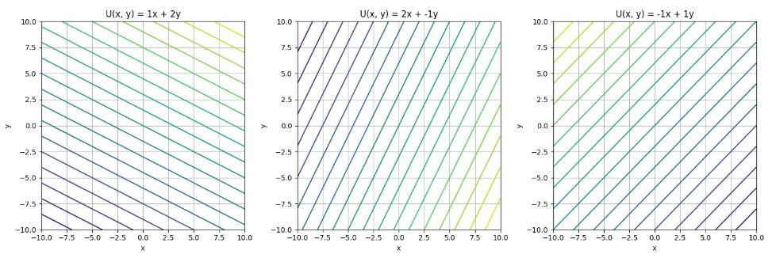
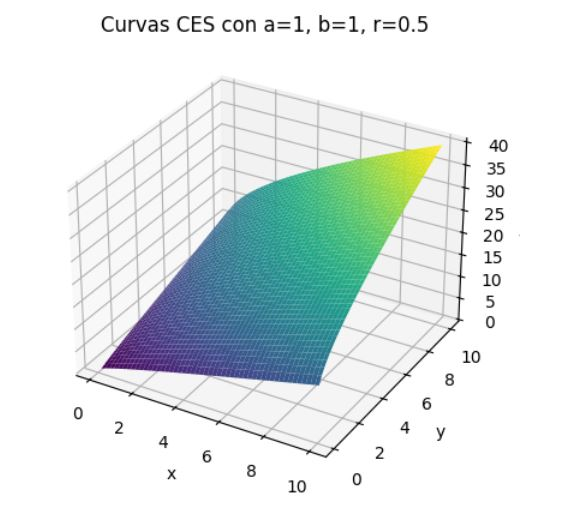

--

# 📈 Proyecto de Curvas de Utilidad e Indiferencia

Este proyecto tiene como objetivo modelar y visualizar las **curvas de utilidad e indiferencia** en el contexto de la teoría económica. 
Las curvas de utilidad e indiferencia son representaciones gráficas que muestran todas las combinaciones de dos bienes que brindan el mismo nivel de satisfacción o utilidad a un consumidor. 
Este modelo es fundamental para entender las decisiones de consumo y preferencia en economía.

## ✨ Funcionalidades

- 📊 **Generación de curvas de utilidad**: Crea curvas basadas en distintas funciones matemáticas.
- 🌀 **Visualización de curvas de indiferencia**: Representa gráficamente la utilidad constante para un consumidor.
- 🎛️ **Análisis interactivo**: Permite ajustar parámetros y observar los cambios en tiempo real.
- 🧮 **Tipos de funciones de utilidad compatibles**:
  - Lineales
  - Cobb-Douglas
  - CES (Elasticidad de Sustitución Constante)

## ⚙️ Requisitos

- `numpy`
- `matplotlib`
- `scipy`

Instalación de dependencias:

```bash
pip install numpy matplotlib scipy
```

## 🚀 Instalación

1. 🔽 Clona este repositorio:

```bash
git clone https://github.com/tu-usuario/curvas-utilidad-indiferencia.git
```

2. 📂 Entra al directorio:

```bash
cd curvas-utilidad-indiferencia
```

3. 📦 Instala las dependencias:

```bash
pip install -r requirements.txt
```

4. ▶️ Ejecuta el programa:

```bash
python main.py
```

## 🧠 Uso

Puedes personalizar los parámetros desde `main.py` para ver diferentes curvas:

📐 Ejemplos de funciones de utilidad:
- `U(x, y) = ax + by` (Lineal)
- `U(x, y) = x^a * y^b` (Cobb-Douglas)
- `U(x, y) = (a * x^r + b * y^r)^(1/r)` (CES)

## 🌈 Ejemplos de Visualización

> 💡 *Estos gráficos se generan al ejecutar el código con distintos parámetros.*

### 🟦 Curva de Utilidad Lineal



### 🟩 Curva de Utilidad Cobb-Douglas


### 🟧 Curva de Utilidad CES



## 🤝 Contribuciones

¿Quieres colaborar?

1. Haz un **fork** del repositorio.
2. Crea una nueva **rama** para tus cambios.
3. Haz tus **commits** con claridad.
4. Abre un **Pull Request** explicando tus aportes.

## 📜 Licencia

Este proyecto está bajo la Licencia MIT. Consulta el archivo [LICENSE](LICENSE) para más información.

---


## Instalación

1. Clona este repositorio en tu máquina local:

```bash
git clone https://github.com/tu-usuario/curvas-utilidad-indiferencia.git
```

2. Navega al directorio del proyecto:

```bash
cd curvas-utilidad-indiferencia
```

3. Instala las dependencias necesarias:

```bash
pip install -r requirements.txt
```

4. Ejecuta el código:

```bash
python main.py
```

## Uso

El proyecto está diseñado para ser interactivo. Puedes modificar los parámetros de la función de utilidad en el archivo `main.py` y visualizar los cambios en tiempo real. Algunos ejemplos de funciones de utilidad incluyen:

- **Función Lineal**: `U(x, y) = ax + by`
- **Función Cobb-Douglas**: `U(x, y) = x^a * y^b`
- **Función CES**: `U(x, y) = (a * x^r + b * y^r)^(1/r)`

## Ejemplo de Visualización

A continuación, se presentan algunos ejemplos de cómo se ven las curvas de indiferencia para distintas funciones de utilidad:

### Curva de Utilidad Lineal


### Curva de Utilidad Cobb-Douglas


### Curva de Utilidad CES


## Contribuciones

Si deseas contribuir al proyecto, por favor sigue los siguientes pasos:

1. Haz un fork de este repositorio.
2. Crea una rama con la funcionalidad que deseas agregar.
3. Realiza los cambios y haz commit.
4. Abre un Pull Request detallando los cambios realizados.

## Licencia

Este proyecto está licenciado bajo la Licencia MIT - ver el archivo [LICENSE](LICENSE) para más detalles.

---

Este README proporciona una descripción general del proyecto, cómo instalarlo, cómo usarlo y algunos ejemplos gráficos de las curvas. 
